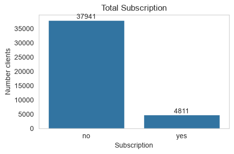
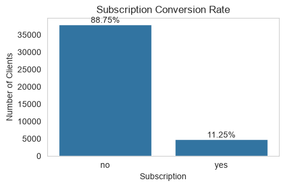

# Project Python for Data
Project part of the ThePower course Data & Analytics V3

This project aims to analyze two datasets related to a Portuguese bank marketing campaign.
The main objective is to understand the factors associated with customers’ product subscription success. 
The datasets contain information such as customer demographics, service seniority, customer behaviour, and marketing campaign interactions.These will be used to understand factors influencing customer subscription success. 

This script is structured in 4 phases:
1. Load and data verification
   - Import the two datasets to perform initial checks. Ensure the data has been loaded correctly and is ready for analysis.
2. Data cleaning and transformation
   - Assess and prepare the datasets by resolving data quality issues, ensuring consistency across variables, standardizing formats, and applying necessary transformations to facilitate the analysis.
3. Data merge
   - Combine the two cleaned datasets into a single dataframe. Save the new dataset.
4. Data description and findings
   - Explore and summarize the integrated dataset to identify the factors related to customer subscription success.
5. Final conclusions
   - Summarize the key findings and highlight the main insights.

   *The analysis of the merged bank marketing campaign and customer datasets shows that the campaign achieved an overall subscription conversion rate of 11.25%, with 4,811 successful subscriptions out of 42,752 customer. Although the campaign generated a substantial number of conversions, the majority of customers (88.75%) did not subscribe, indicating opportunities to improve.*

**Customer Demographics**

Demographic characteristics were among the strongest predictors of subscription success.
 Customers aged 30 years or younger and 51 years or older achieved higher conversion rates than the middle-aged segment (31–50 years).
 Students and retired customers recorded the highest subscription rates among occupational groups. Single customers were more likely to subscribe than married or divorced customers.
 Customers with higher levels of education, particularly university graduates, generally demonstrated stronger subscription performance
   - These findings suggest that customer life stage and educational attainment may influence responsiveness to marketing campaigns.

   
   

**Social and Economic Factors**

 Most social and economic indicators showed only limited influence on subscription outcomes.
 Income level, housing loans, personal loans, and household composition produced relatively similar conversion rates across categories.
 Web activity levels showed almost no variation in conversion performance, indicating that browsing activity alone is not a reliable predictor of subscription likelihood.
 Customers with no history of payment default achieved higher subscription rates than customers with unknown or negative default status.

Overall, demographic characteristics appear to be more informative than socio-economic indicators for predicting campaign success.

**Marketing Campaign Factors**

 Marketing-related variables showed the strongest relationship with subscription outcomes.
 Customers contacted through the cellular channel achieved substantially higher conversion rates than those contacted by telephone.
 The highest conversion rates were observed during the first three contact attempts, with performance declining as additional contacts were made.
 Call duration emerged as the most influential campaign indicator. Longer conversations were associated with significantly higher subscription rates, suggesting that customer engagement during the interaction is strongly linked to campaign success.

 Previous campaign contacts and outcomes provided limited analytical value due to the large proportion of customers with no prior campaign history.

 **Key Business Insights**

 The results suggest that future campaigns should prioritize:
   - Targeting younger and older customer segments, particularly students and retirees;
   - Increasing the use of cellular as communication channels;
   - Focusing on high-quality customer interactions rather than increasing the number of contact attempts;
   - Limiting repeated outreach after three unsuccessful contacts;
   - Using demographic characteristics as primary segmentation variables when selecting campaign audiences.

**Final Assessment**

*The analysis indicates that marketing execution factors, particularly communication channel, number of contacts, and call duration, have a greater impact on subscription success than most socio-economic characteristics. While demographic factors help identify customer segments with higher conversion potential, the effectiveness of customer engagement during the campaign appears to be the primary driver of successful subscriptions. Future marketing efforts should therefore emphasize targeted customer selection combined with more efficient and personalized communication strategies.*